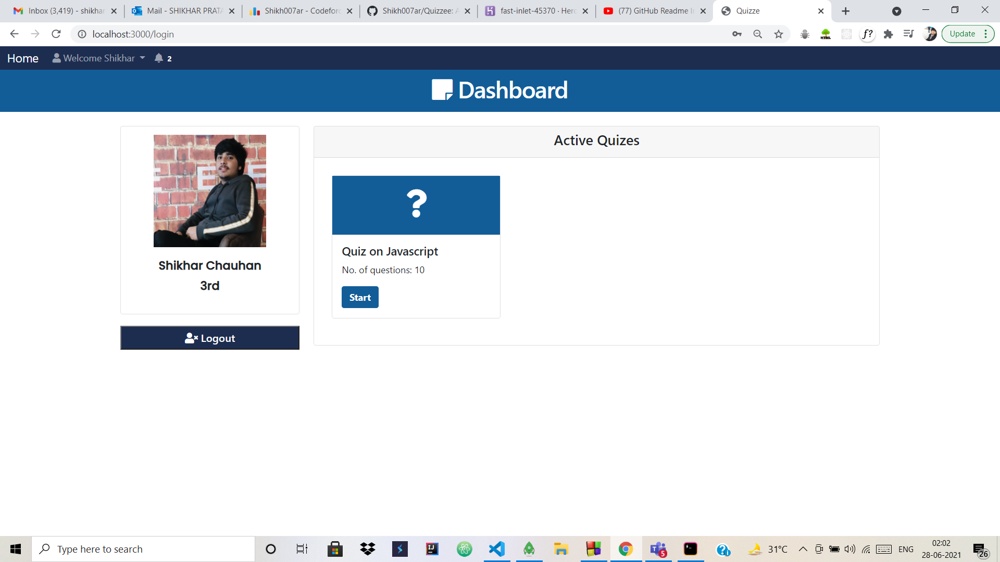
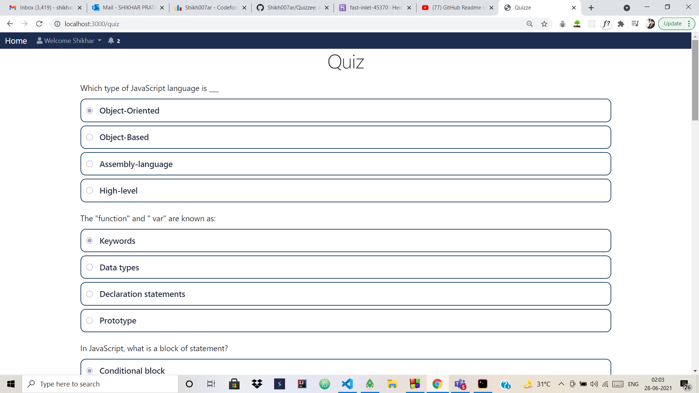
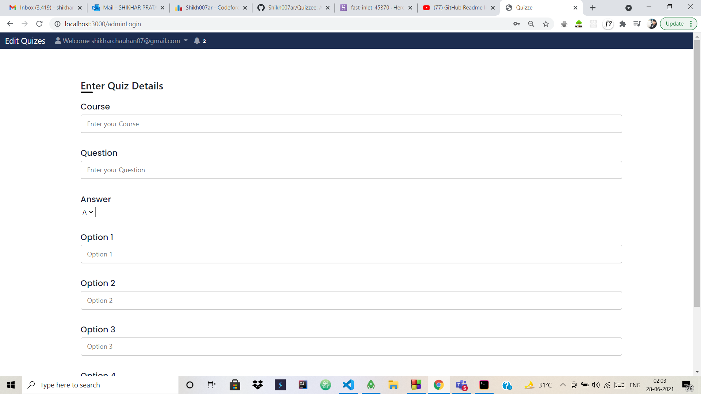
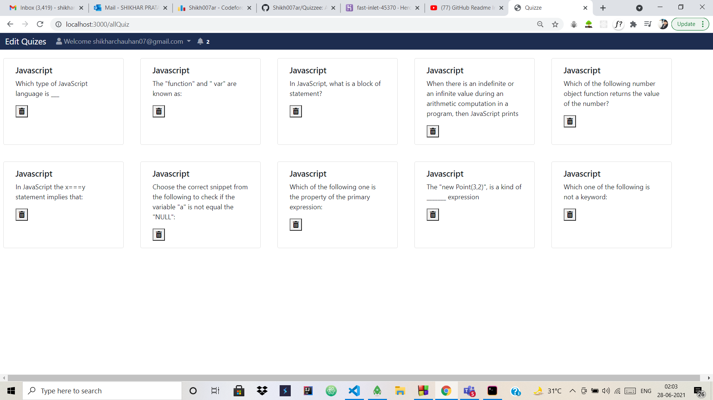

# Quizzee
An online Quiz portal with student and Admin interfaces.

Step 1- Run git clone in terminal to get all codes file into your local system.
Step 2- Run npm install, to download all dependencies.
Step 3- Run nodemon app.js to run the app on Localhost:3000.

